# Workflow Diagrams - Complete License Curation System

> Visual representation of all workflows in the Enhanced ORT License Curation System with Advanced Policy Management

---

## Table of Contents

1. [Overall System Architecture](#overall-system-architecture)
2. [Enhanced ORT Workflow (GitHub Actions)](#enhanced-ort-workflow-github-actions)
3. [Advanced License Curation Workflow](#advanced-license-curation-workflow)
4. [Policy Compliance Decision Tree](#policy-compliance-decision-tree)
5. [License Change Monitoring Flow](#license-change-monitoring-flow)
6. [Alternative Package Finding Process](#alternative-package-finding-process)
7. [Complete Integration Architecture](#complete-integration-architecture)
8. [Daily Operations Flow](#daily-operations-flow)

---

## Overall System Architecture


---

## Enhanced ORT Workflow (GitHub Actions)

### Complete Workflow Stages


---

## Advanced License Curation Workflow

### Policy-Based Compliance System

```mermaid
flowchart TB
    Start([ORT Results Available]) --> LoadPolicy[Load Company Policy<br/>company-policy.yml]
    LoadPolicy --> ParseORT[Parse ORT Results<br/>Extract Package Licenses]

    ParseORT --> Loop{For Each<br/>Package}

    Loop --> GetLicense[Get Package License<br/>declared/concluded]

    GetLicense --> NormalizeLic[Normalize License<br/>BSD License → BSD-3-Clause]

    NormalizeLic --> CheckPolicy{Check Against<br/>Company Policy}

    CheckPolicy -->|Found in Approved| Approved[Status: APPROVED<br/>Auto-approve: True<br/>Risk: LOW]
    CheckPolicy -->|Found in Conditional| Conditional[Status: CONDITIONAL<br/>Approval Required<br/>Risk: MEDIUM]
    CheckPolicy -->|Found in Forbidden| Forbidden[Status: FORBIDDEN<br/>Alternative Needed<br/>Risk: CRITICAL]
    CheckPolicy -->|Not Found| Unknown[Status: UNKNOWN<br/>Research Required<br/>Risk: HIGH]

    Approved --> CheckDual{Dual License?<br/>MIT OR Apache}
    Conditional --> CheckApprovers[Identify Approvers<br/>legal@company.com]
    Forbidden --> FindAlt[Trigger Alternative<br/>Package Finder]
    Unknown --> ResearchPath[Research Path<br/>PyPI → ScanCode → Manual]

    CheckDual -->|Yes| ChooseBest[Choose Most Permissive<br/>Per Policy Strategy]
    CheckDual -->|No| StoreResult

    ChooseBest --> StoreResult[Store Result<br/>PolicyCheckResult]
    CheckApprovers --> StoreResult
    FindAlt --> StoreResult
    ResearchPath --> StoreResult

    StoreResult --> MorePackages{More<br/>Packages?}
    MorePackages -->|Yes| Loop
    MorePackages -->|No| CalcScore[Calculate Compliance Score<br/>Approved / Total × 100]

    CalcScore --> GenReport[Generate HTML Report<br/>Color-coded Status]
    GenReport --> ExportJSON[Export JSON<br/>For Automation]

    ExportJSON --> CheckCritical{Forbidden or<br/>Critical Risk?}
    CheckCritical -->|Yes| FailBuild[Exit Code 1<br/>Fail CI/CD Build]
    CheckCritical -->|No| PassBuild[Exit Code 0<br/>Pass Build]

    FailBuild --> End([Complete])
    PassBuild --> End

    style Start fill:#4caf50,color:#fff
    style End fill:#4caf50,color:#fff
    style Approved fill:#c8e6c9
    style Conditional fill:#fff9c4
    style Forbidden fill:#ffcdd2
    style Unknown fill:#e0e0e0
    style FailBuild fill:#f44336,color:#fff
    style PassBuild fill:#4caf50,color:#fff
```



---

## Policy Compliance Decision Tree

### Master Decision Logic

```mermaid
flowchart TD
    Start([Package License<br/>Detection]) --> Normalize[Normalize License String]

    Normalize --> CheckType{License<br/>Expression<br/>Type?}

    CheckType -->|Single| Single[Single License<br/>e.g., MIT]
    CheckType -->|OR| DualLic[Dual License<br/>e.g., MIT OR Apache-2.0]
    CheckType -->|AND| MultiLic[Multi License<br/>e.g., MIT AND BSD-3-Clause]

    Single --> LookupSingle[Lookup in Policy Database]
    DualLic --> Strategy{Policy<br/>Strategy?}
    MultiLic --> CheckCompat[Check Compatibility Matrix]

    Strategy -->|choose_most_permissive| ChoosePerm[Choose Most Permissive<br/>Prefer Approved]
    Strategy -->|manual_review| ManualRev[Flag for Manual Review]

    ChoosePerm --> LookupSingle
    ManualRev --> Conditional
    CheckCompat --> Compatible{All<br/>Compatible?}

    Compatible -->|Yes| AllApproved{All<br/>Approved?}
    Compatible -->|No| Incompatible[Status: INCOMPATIBLE<br/>Risk: CRITICAL]

    AllApproved -->|Yes| Approved
    AllApproved -->|No| AnyForbidden{Any<br/>Forbidden?}

    AnyForbidden -->|Yes| Forbidden
    AnyForbidden -->|No| Conditional

    LookupSingle --> Found{Found in<br/>Policy?}

    Found -->|Approved List| Approved[✅ APPROVED<br/>Green Status<br/>Auto-approve]
    Found -->|Conditional List| Conditional[⚠️ CONDITIONAL<br/>Yellow Status<br/>Needs Approval]
    Found -->|Forbidden List| Forbidden[❌ FORBIDDEN<br/>Red Status<br/>Find Alternative]
    Found -->|Not Found| Unknown[❓ UNKNOWN<br/>Gray Status<br/>Research]

    Approved --> Actions1[Actions:<br/>- Generate Curation<br/>- Proceed with Build]
    Conditional --> Actions2[Actions:<br/>- Request Approval<br/>- Document Use Case<br/>- Wait for Decision]
    Forbidden --> Actions3[Actions:<br/>- Find Alternatives<br/>- Reject Package<br/>- Fail Build]
    Unknown --> Actions4[Actions:<br/>- Research License<br/>- Check PyPI/ScanCode<br/>- Manual Verification]
    Incompatible --> Actions5[Actions:<br/>- Review Combination<br/>- Legal Consultation<br/>- Fail Build]

    Actions1 --> End([Decision Complete])
    Actions2 --> End
    Actions3 --> End
    Actions4 --> End
    Actions5 --> End

    style Start fill:#2196f3,color:#fff
    style End fill:#4caf50,color:#fff
    style Approved fill:#c8e6c9
    style Conditional fill:#fff9c4
    style Forbidden fill:#ffcdd2
    style Unknown fill:#e0e0e0
    style Incompatible fill:#ffcdd2
```



---

## License Change Monitoring Flow

### Historical Tracking and Alert System


---

## Alternative Package Finding Process

### Smart Replacement Recommendations


---

## Complete Integration Architecture

### How All Components Work Together

```mermaid
graph TB
    subgraph "Source Repository"
        A[Source Code] --> B[Dependencies<br/>package.json, requirements.txt]
    end

    subgraph "CI/CD Pipeline - GitHub Actions"
        B --> C[Trigger Workflow<br/>Push/PR/Schedule]
        C --> D[Enhanced ORT Workflow<br/>Stages 1-8]
    end

    subgraph "Stage 1-2: Basic Analysis"
        D --> E[ORT Analyzer<br/>Dependency Detection]
        E --> F[Extract Uncertain Packages<br/>NOASSERTION/UNKNOWN]
    end

    subgraph "Stage 2.5-3: Deep Analysis"
        F --> G[PyPI API Fetch<br/>Fast License Retrieval]
        G --> H[ScanCode Deep Scan<br/>File-level Detection]
    end

    subgraph "Stage 4: Data Consolidation"
        H --> I[Merge Results<br/>ORT + PyPI + ScanCode]
        I --> J[Validate & Fix SPDX<br/>ISO/IEC 5962:2021]
    end

    subgraph "Stage 5: AI Analysis (Optional)"
        J --> K[Main ORT Curation<br/>gpt-4.1-mini]
        K --> L[Conflict Analysis<br/>gpt-4]
        L --> M[Missing Licenses<br/>gpt-4o-mini]
        M --> N[Multi-Layer Comparison<br/>No AI]
        N --> O[AI Resolution<br/>gpt-4.1-mini]
    end

    subgraph "Advanced Policy Management (NEW)"
        O --> P[Policy Checker<br/>policy_checker.py]
        P --> Q{Policy<br/>Decision}
        Q -->|Approved| R[✅ Generate Curation]
        Q -->|Conditional| S[⚠️ Request Approval]
        Q -->|Forbidden| T[❌ Find Alternatives]
        Q -->|Unknown| U[❓ Research Path]
    end

    subgraph "Alternative Finding (NEW)"
        T --> V[Alternative Package Finder<br/>alternative_package_finder.py]
        V --> W[Search Registries<br/>PyPI, NPM, Maven]
        W --> X[Rank by Score<br/>License, Popularity, Maintenance]
        X --> Y[Generate Comparison Report]
    end

    subgraph "License Change Monitoring (NEW)"
        P --> Z[License Change Monitor<br/>license_change_monitor.py]
        Z --> AA[Check History Database<br/>.ort/license-history.json]
        AA --> AB{Changes<br/>Detected?}
        AB -->|Yes| AC[Assess Severity<br/>CRITICAL/HIGH/MEDIUM/LOW]
        AB -->|No| AD[Update Last Verified]
        AC --> AE[Generate Alert Report<br/>Recommended Actions]
    end

    subgraph "Stage 6-7: Deployment"
        R --> AF[Prepare Reports<br/>Copy to public/]
        S --> AF
        Y --> AF
        AE --> AF
        AD --> AF
        U --> AF

        AF --> AG[Generate Landing Page<br/>Auto-detect All Reports]
        AG --> AH{Branch?}
        AH -->|main/master| AI[Deploy to GitHub Pages]
        AH -->|other| AJ[Skip Deployment]
    end

    subgraph "Stage 8: Artifact Storage"
        AI --> AK[Upload Artifacts<br/>30 days retention]
        AJ --> AK
        AK --> AL[ORT Results]
        AK --> AM[ScanCode Results]
        AK --> AN[Policy Reports]
        AK --> AO[Change Alerts]
        AK --> AP[Alternative Reports]
    end

    subgraph "Outputs & Access"
        AI --> AQ[GitHub Pages Site<br/>https://user.github.io/repo]
        AQ --> AR[Stakeholders View Reports:<br/>13+ Report Types]

        AL --> AS[Download for Offline Analysis]
        AM --> AS
        AN --> AS
        AO --> AS
        AP --> AS
    end

    subgraph "Manual Actions"
        S --> AT[Compliance Team<br/>Approval Workflow]
        U --> AU[Developer<br/>Manual Research]
        Y --> AV[Developer<br/>Test Alternative]

        AT --> AW[Update Curations<br/>.ort/curations.yml]
        AU --> AW
        AV --> AW
    end

    AW --> AX[Re-run Workflow<br/>Verify Fix]
    AX --> C

    style P fill:#ff9800,color:#fff
    style V fill:#ff9800,color:#fff
    style Z fill:#ff9800,color:#fff
    style AQ fill:#4caf50,color:#fff
    style R fill:#c8e6c9
    style S fill:#fff9c4
    style T fill:#ffcdd2
    style U fill:#e0e0e0
```



---

## Daily Operations Flow

### Typical Day-to-Day Usage


---

## Component Interaction Matrix

### How Each Component Communicates

| Component | Inputs | Outputs | Triggers |
|-----------|--------|---------|----------|
| **ORT Analyzer** | Source code, Dependencies | `analyzer-result.yml` | Manual, CI/CD |
| **Policy Checker** | ORT results, Policy YAML | Compliance report (HTML/JSON) | After ORT |
| **Alternative Finder** | Forbidden package info | Alternatives report (HTML) | When forbidden detected |
| **Change Monitor** | ORT results, History DB | Change alert report (HTML) | After ORT |
| **PyPI Fetcher** | Uncertain packages | PyPI licenses JSON | After extraction |
| **ScanCode** | Package sources | License detections (JSON) | After PyPI |
| **AI Curation** | All above results | Curation recommendations | After merge |
| **Landing Page** | All reports | Unified HTML index | Before deployment |

---

## Legend

### Status Colors

- 🟢 **Green** - Approved/Success/Pass
- 🟡 **Yellow** - Conditional/Warning/Needs Review
- 🔴 **Red** - Forbidden/Error/Fail
- ⚪ **Gray** - Unknown/Pending/Research Needed
- 🔵 **Blue** - Processing/In Progress
- 🟣 **Purple** - AI/ML Analysis
- 🟠 **Orange** - New Feature/Enhancement

### Severity Levels

- ⛔ **CRITICAL** - Immediate action required (permissive → copyleft)
- ⚠️ **HIGH** - Urgent review needed (unusual changes)
- 📋 **MEDIUM** - Review recommended (license family change)
- ℹ️ **LOW** - Awareness only (minor changes)

---

## Quick Reference

### Workflow Files Locations

```
Repository Root/
├── .github/workflows/
│   └── license-compliance.yml          # GitHub Actions workflow
│
├── Advanced_License_Curation_Workflow/
│   ├── config/
│   │   └── company-policy.yml         # Policy database
│   ├── scripts/
│   │   ├── policy_checker.py          # Policy compliance
│   │   ├── alternative_package_finder.py  # Find replacements
│   │   └── license_change_monitor.py  # Track changes
│   └── .ort/
│       └── license-history.json       # Historical tracking
│
└── ort-results/
    ├── analyzer/analyzer-result.yml   # ORT output
    └── reporter/bom.spdx.yml          # SPDX SBOM
```

---

**For detailed implementation guides, see:**
- [README.md](README.md) - Complete documentation
- [SETUP_SUMMARY.md](SETUP_SUMMARY.md) - Quick start guide
- [docs/QUICK_START.md](docs/QUICK_START.md) - 15-minute tutorial

*Generated: 2025-01-16*
