# Enhanced ORT Workflow - Complete Flow Diagrams

This document provides visual representations of the Enhanced ORT License Curation System workflow using Mermaid diagrams.

---

## Table of Contents

1. [Overall System Architecture](#overall-system-architecture)
2. [GitHub Actions Workflow](#github-actions-workflow)
3. [Multi-Tool Analysis Pipeline](#multi-tool-analysis-pipeline)
4. [AI Curation Decision Tree](#ai-curation-decision-tree)
5. [Report Generation Flow](#report-generation-flow)
6. [Deployment Pipeline](#deployment-pipeline)

---

## Overall System Architecture

---

## GitHub Actions Workflow

### Complete Workflow Stages

---

## Multi-Tool Analysis Pipeline

### Tier-Based License Detection

```mermaid
flowchart LR
    Source[Source Code<br/>Dependencies] --> Tier1{Tier 1:<br/>ORT Analyzer}

    Tier1 --> ORTResults[ORT Results<br/>Package Metadata<br/>Declared Licenses]
    ORTResults --> Check1{All Licenses<br/>Found?}

    Check1 -->|Yes - 100%| Success[✅ Complete<br/>All Licenses Known]
    Check1 -->|No - Gaps Found| Tier2{Tier 2:<br/>Extract Uncertain}

    Tier2 --> UncertainList[Uncertain Packages List<br/>NOASSERTION/UNKNOWN<br/>Empty Licenses]

    UncertainList --> Tier3{Tier 3:<br/>PyPI API Fetch}

    Tier3 --> PyPIFetch[PyPI API Calls<br/>Fast - No Scanning<br/>Multiple Metadata Sources]
    PyPIFetch --> PyPIResults[PyPI Results<br/>License Field<br/>License Expression<br/>Classifiers]

    PyPIResults --> Check2{More<br/>Licenses<br/>Found?}
    Check2 -->|Yes - 50-70%| Reduce[Reduced Uncertain List<br/>Remaining Packages]
    Check2 -->|No Improvement| Reduce

    Reduce --> Tier4{Tier 4:<br/>ScanCode Deep Scan}

    Tier4 --> ScanDeep[ScanCode Scanning<br/>File-Level Detection<br/>Package Manifest<br/>Source Files]
    ScanDeep --> ScanResults[ScanCode Results<br/>Package-Level License<br/>File-Level Licenses<br/>Confidence Scores]

    ScanResults --> Tier5{Tier 5:<br/>SPDX Merge}

    Tier5 --> MergeSPDX[Merge All Results<br/>ORT + PyPI + ScanCode<br/>High Confidence Only]
    MergeSPDX --> ValidateSPDX[Validate SPDX<br/>Fix Broken References<br/>Enhanced SPDX Document]

    ValidateSPDX --> Tier6{Tier 6:<br/>AI Curation}

    Tier6 --> AIAnalysis[AI-Powered Analysis<br/>Conflict Resolution<br/>Missing License Research<br/>Advisory Only]

    AIAnalysis --> Final{Final Step:<br/>Manual Review}

    Final --> ManualVerify[👤 Human Verification<br/>Check LICENSE Files<br/>Compliance Approval<br/>Add Curations]

    ManualVerify --> Complete[✅ 100% Coverage<br/>Production Ready]

    Success --> Complete

    style Source fill:#e3f2fd
    style Tier1 fill:#bbdefb
    style Tier2 fill:#90caf9
    style Tier3 fill:#64b5f6
    style Tier4 fill:#42a5f5
    style Tier5 fill:#2196f3
    style Tier6 fill:#1976d2
    style Final fill:#0d47a1
    style Complete fill:#4caf50,color:#fff
    style Success fill:#4caf50,color:#fff
```

---

## AI Curation Decision Tree

### AI Report Generation Logic

---

## Report Generation Flow

### All Report Types

---

## Deployment Pipeline

### GitHub Pages Deployment Flow

```mermaid
flowchart TD
    Start[Stage 6: Prepare Deployment] --> CheckReports{Check Available<br/>Reports}

    CheckReports --> ORT{ORT Reports<br/>Exist?}
    ORT -->|Yes| CopyORT[Copy ORT Reports<br/>WebApp, Static HTML<br/>SPDX, CycloneDX]
    ORT -->|No| SkipORT[Skip ORT]

    CopyORT --> AI{AI Reports<br/>Exist?}
    SkipORT --> AI

    AI -->|Yes| CopyAI[Copy AI Reports<br/>Main, Conflicts<br/>Missing, Resolution]
    AI -->|No| SkipAI[Skip AI]

    CopyAI --> PyPI{PyPI Reports<br/>Exist?}
    SkipAI --> PyPI

    PyPI -->|Yes| CopyPyPI[Copy PyPI Reports<br/>HTML, JSON, CSV]
    PyPI -->|No| SkipPyPI[Skip PyPI]

    CopyPyPI --> Scan{ScanCode Reports<br/>Exist?}
    SkipPyPI --> Scan

    Scan -->|Yes| CopyScan[Copy ScanCode Reports<br/>Individual HTML/JSON/YAML<br/>Consolidated Reports]
    Scan -->|No| SkipScan[Skip ScanCode]

    CopyScan --> Enhanced{Enhanced Reports<br/>Exist?}
    SkipScan --> Enhanced

    Enhanced -->|Yes| CopyEnhanced[Copy Enhanced Reports<br/>Enhanced SPDX<br/>Merge Reports]
    Enhanced -->|No| SkipEnhanced[Skip Enhanced]

    CopyEnhanced --> Multi{Multi-Layer Reports<br/>Exist?}
    SkipEnhanced --> Multi

    Multi -->|Yes| CopyMulti[Copy Multi-Layer Reports<br/>License Comparison<br/>AI Resolution]
    Multi -->|No| SkipMulti[Skip Multi-Layer]

    CopyMulti --> Generate[Generate Landing Page<br/>Auto-Detect All Reports<br/>Create index.html]
    SkipMulti --> Generate

    Generate --> CheckBranch{Current Branch?}

    CheckBranch -->|main| Deploy[Deploy to Pages]
    CheckBranch -->|master| Deploy
    CheckBranch -->|Other| SkipDeploy[Skip Deployment<br/>Only for main/master]

    Deploy --> SetupPages[Setup GitHub Pages]
    SetupPages --> ConfigPages[Configure Pages<br/>Source: GitHub Actions]
    ConfigPages --> UploadArtifact[Upload Pages Artifact<br/>public/ directory]
    UploadArtifact --> DeployAction[Deploy Pages Action<br/>Publish to GitHub Pages]

    DeployAction --> Verify{Deployment<br/>Successful?}

    Verify -->|Yes| Success[✅ Deployment Complete<br/>Reports Live]
    Verify -->|No| Fail[❌ Deployment Failed<br/>Check Logs]

    Success --> URL[📍 Reports Available At:<br/>https://username.github.io/repo/]

    SkipDeploy --> Artifacts[Upload Artifacts Only<br/>30 Days Retention]
    Fail --> Artifacts

    Artifacts --> End[Workflow Complete]
    URL --> End

    style Start fill:#00bcd4,color:#fff
    style Deploy fill:#4caf50,color:#fff
    style Success fill:#4caf50,color:#fff
    style URL fill:#8bc34a,color:#fff
    style Fail fill:#f44336,color:#fff
    style SkipDeploy fill:#ff9800,color:#fff
    style End fill:#607d8b,color:#fff
```

---

## Parallel vs Sequential Execution

### Workflow Execution Strategy

**Key Observations:**
- **Sequential:** ORT stages must run in order (Analyzer → Advisor → Reporter)
- **Sequential:** ScanCode depends on uncertain packages extraction
- **Parallel:** AI reports can run simultaneously (except AI Resolution depends on Comparison)
- **Total Time:** ~26-30 minutes for complete workflow

---

## Error Handling Flow

### Continue-on-Error Strategy

**Stages with continue-on-error: true:**
- ✅ ORT Advisor (optional vulnerability scanning)
- ✅ ScanCode Scanning (optional deep analysis)
- ✅ All AI Reports (optional AI analysis)
- ✅ GitHub Pages Deployment (not available on PRs)

**Stages that MUST succeed:**
- ❌ ORT Analyzer (critical - base dependency analysis)
- ❌ Install dependencies (critical - setup)

---

## Cost Optimization Flow

### AI Usage and Cost Control

---

## Summary

This workflow documentation provides complete visual representations of:

1. **Overall System Architecture** - High-level system flow
2. **GitHub Actions Workflow** - Detailed CI/CD pipeline with all stages
3. **Multi-Tool Analysis Pipeline** - 6-tier license detection approach
4. **AI Curation Decision Tree** - AI report generation logic and fallbacks
5. **Report Generation Flow** - All 13+ report types and relationships
6. **Deployment Pipeline** - GitHub Pages deployment process
7. **Parallel vs Sequential Execution** - Timing and execution strategy
8. **Error Handling Flow** - Continue-on-error strategy
9. **Cost Optimization Flow** - AI usage limits and cost control

### Key Features:

- ✅ **Visual Clarity** - Mermaid diagrams for easy understanding
- ✅ **Decision Points** - Shows all conditional logic
- ✅ **Error Handling** - Continue-on-error and fallback paths
- ✅ **Cost Control** - AI usage limits clearly shown
- ✅ **Parallel Execution** - Shows which stages can run simultaneously
- ✅ **Complete Coverage** - All 8 workflow stages documented

### Usage:

These diagrams can be viewed:
- **In GitHub** - Mermaid is natively supported in GitHub markdown
- **In VS Code** - With Mermaid preview extension
- **Online** - At https://mermaid.live/ (paste diagram code)
- **In Documentation** - Renders in most modern markdown viewers

---

**Last Updated:** 2025-01-15
**Version:** 2.0 - Multi-Layer Resolution Enhancement
**Diagrams:** 9 comprehensive flow diagrams
